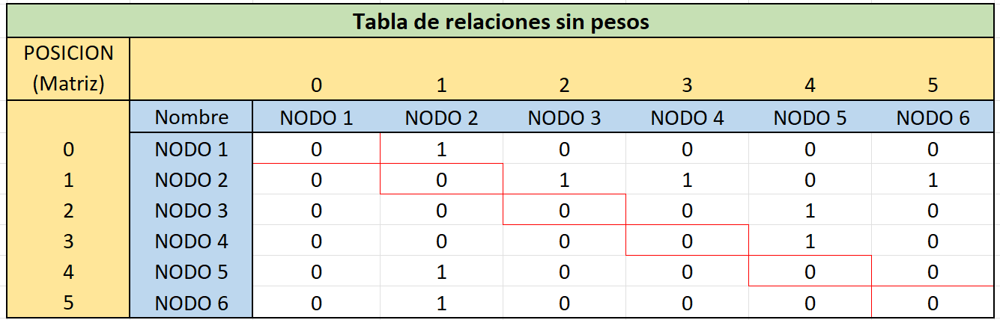
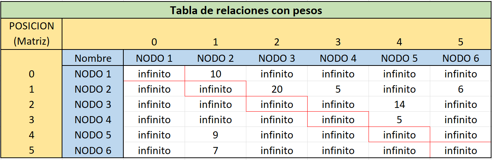
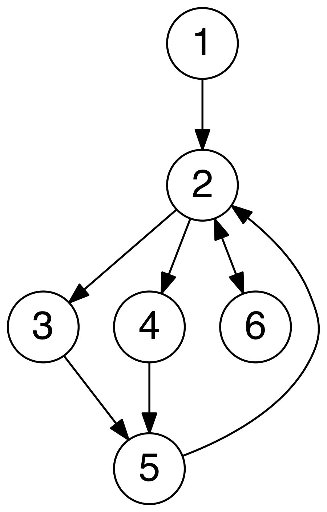

# Graph example

## 📂 Folder structure

```ascii
.
└── graph-example/
    ├── bin
    ├── lib/
    │   └── catch.hpp
    ├── src/
    │   ├── graph/
    │   │   ├── Graph.hpp
    │   │   ├── Graph.hxx
    │   │   └── node/
    │   │       └── Node.hpp
    │   │
    │   └── main.cpp
    └── test/
        └── graph_test.cpp
```

The diagram was created with [tree nathanfriend](https://tree.nathanfriend.io/) tool.

### 🧪 Tests

Tests may take some time to compile, be patient.

#### 🐧 Linux

Must be in the project root folder.

```bash
 g++ ./test/graph_test.cpp -o ./bin/graph_test
```

#### 🪟 Windows

Must be in the project root folder.

```powershell
 g++ .\test\graph_test.cpp -o .\bin\graph_test.exe
```

### 🚪Main app

#### 🐧 Linux

Must be in the project root folder.

```bash
 g++ ./src/main.cpp -o ./bin/main
```

#### 🪟 Windows

Must be in the project root folder.

```powershell
 g++ .\src\main.cpp -o .\bin\main.exe
```

## Running Tests

To run tests, run the following command, you must be in the project root folder.

#### 🐧 Linux

If you just wanna know the information of the tests that fails run:

```bash
  ./bin/graph_test
```

If you wanna get all the information of the tests, no matter if it approved passed or failed:

```bash
  ./bin/graph_test -s
```

> Must use the macro INFO to get the information of the test.

If you wanna get all the information of available test cases:

```bash
  ./bin/graph_test -l
```

#### 🪟 Windows

If you just wanna know the information of the tests that fails run:

```bash
  .\bin\graph_test.exe
```

If you wanna get all the information of the tests, no matter if it approved passed or failed:

```bash
  .\bin\graph_test.exe -s
```

If you wanna get all the information of available test cases:

```bash
  .\bin\graph_test.exe -l
```

## Run main app

To run the `main.cpp`, run the following command, you must be in the project root folder.

#### 🐧 Linux

```bash
  ./bin/main
```

#### 🪟 Windows

```powershell
  .\bin\main.exe
```

## 🖼️ Resource images





